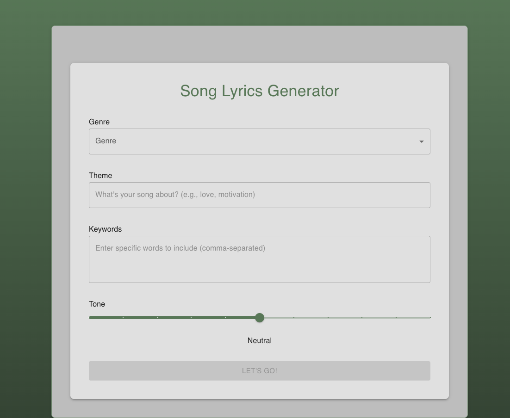
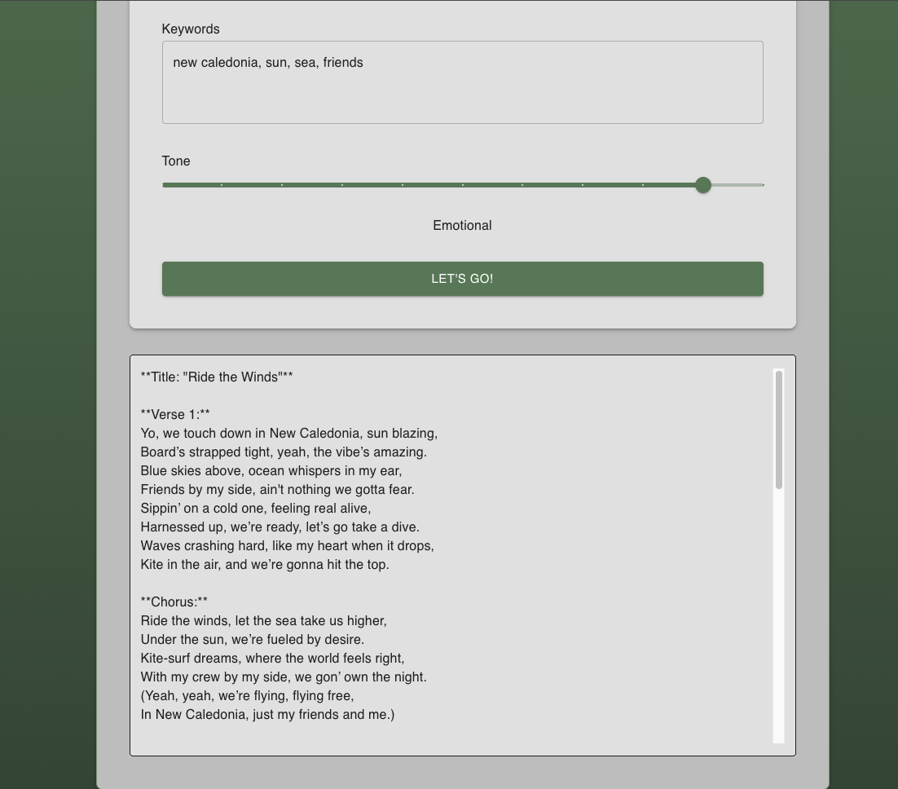

## AI Lyrics generator

This is a simple lyrics generator app that uses OpenAI's GPT-4o-mini model to generate song lyrics based on user input. 

The app is built using Next.js v15 App router, React 19, MUI v5 and AI SDK.

I know the app is far from perfect :) 
The main goal of this project was to ramp up on Next.js v15 App router and to explore the capabilities of the AI SDK.

You can try it at: https://lyrics-generator-nextjs.vercel.app/

### Screenshots

